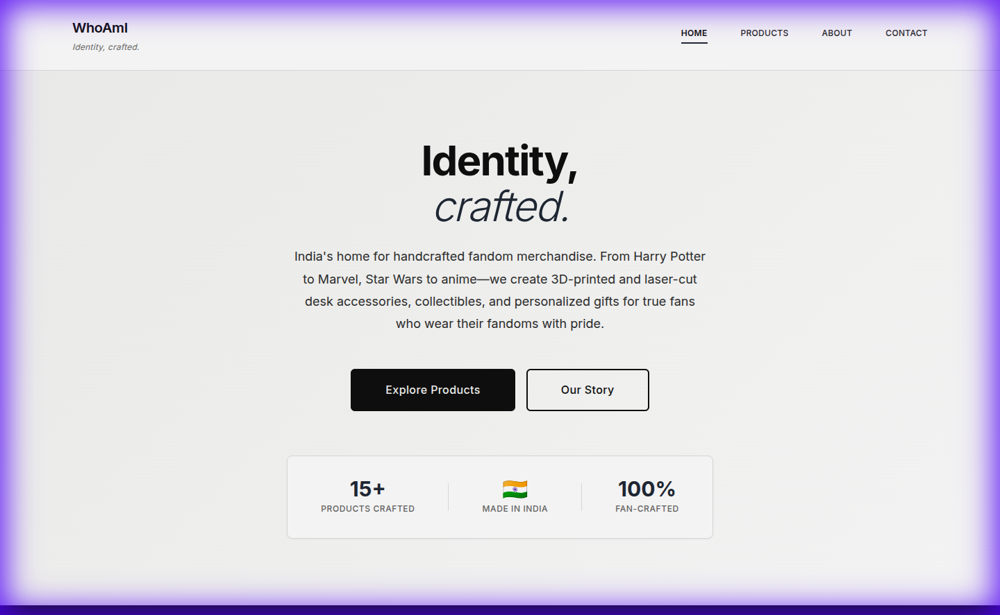
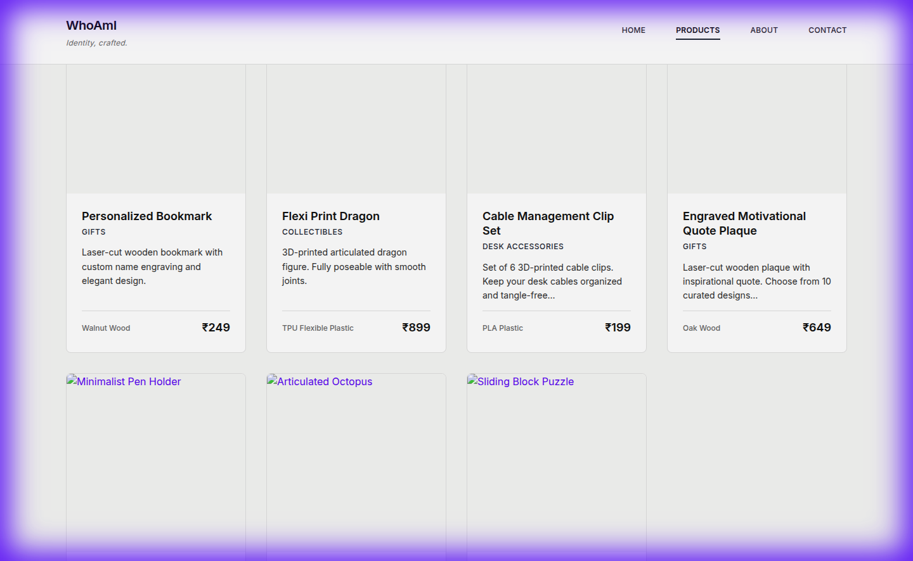
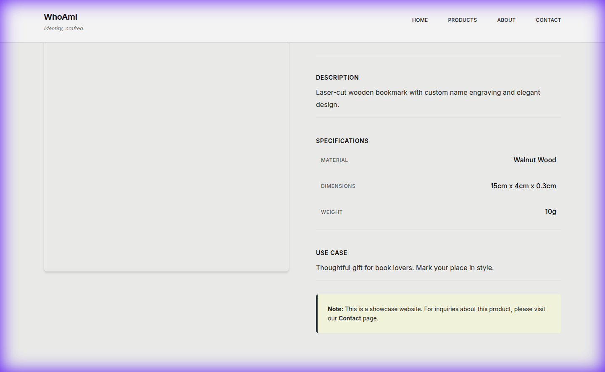
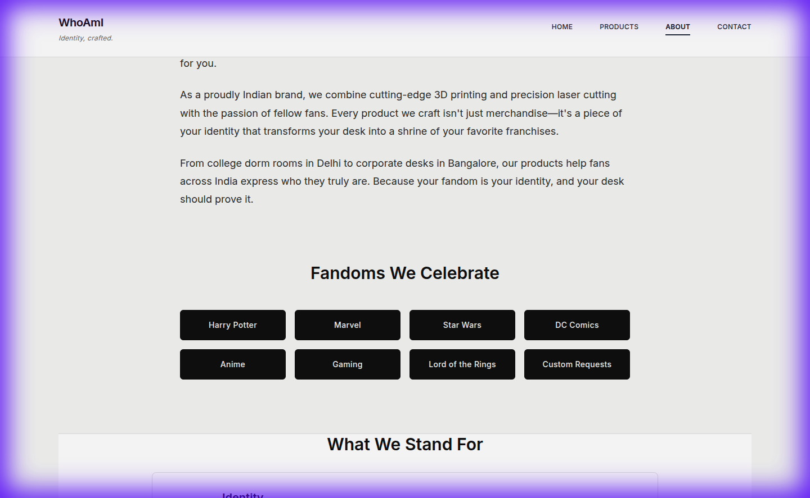
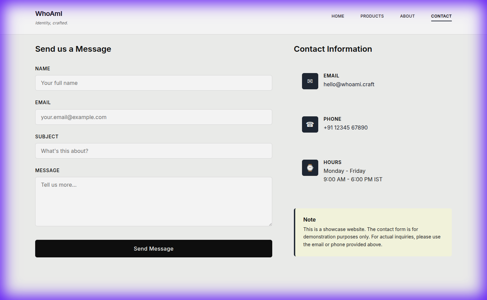

# WhoAmI - Fandom Merchandise Showcase

> **Identity, crafted.** 🇮🇳

A minimalistic, premium product showcase website for **WhoAmI** - India's home for handcrafted fandom merchandise. 3D-printed and laser-cut desk accessories, collectibles, and personalized gifts for fans of Harry Potter, Marvel, Star Wars, DC Comics, Anime, and more.

---

## 🎯 About WhoAmI

WhoAmI is an Indian D2C brand that creates handcrafted merchandise for fantasy franchise fans. Our products help fans:

- **Prove their identity** - Display your Hogwarts house, your favorite Avenger, or your allegiance to the Force
- **Decorate their desks** - Transform workspaces into fandom shrines with premium desk accessories
- **Gift with meaning** - Find personalized gifts that resonate with fellow fans

**This is a showcase website** - displaying products, designs, use-cases, and pricing. No e-commerce functionality (no cart, checkout, or payment).

---

## 📸 Screenshots

### Home Page
Hero section with brand messaging and fandom showcase.



### Products Page
Product grid with category filters. All data loaded from Excel file.



### Product Detail
Individual product information with specifications and use cases.



### About Page
Brand story, values, and "Proudly Made in India" emphasis.



### Contact Page
Contact form and information.



---

## 🛠️ Tech Stack

### Frontend
- **React** with Vite
- **React Router DOM** for multi-page navigation
- **Axios** for API requests
- **Vanilla CSS** with custom design system

### Backend
- **Node.js** + **Express**
- **xlsx** for Excel file parsing
- **CORS** for cross-origin requests

### Design System
| Color | Hex | Usage |
|-------|-----|-------|
| Charcoal Black | `#0F0F0F` | Primary text, headers |
| Warm White | `#F5F5F3` | Backgrounds |
| Graphite Grey | `#2B2B2B` | Secondary text |
| Deep Blue-Grey | `#1E2A33` | Accent color |

Typography: **Inter** (Google Fonts)

---

## 📁 Project Structure

```
web/
├── src/
│   ├── components/
│   │   ├── Navbar/          # Navigation bar
│   │   ├── Footer/          # Footer with brand info
│   │   ├── ProductCard/     # Product display cards
│   │   ├── CollectionGrid/  # Filterable product grid
│   │   └── Hero/            # Hero section
│   ├── pages/
│   │   ├── Home/            # Landing page
│   │   ├── Products/        # Product listing
│   │   ├── ProductDetail/   # Single product view
│   │   ├── About/           # Brand story
│   │   └── Contact/         # Contact form
│   ├── styles/
│   │   └── theme.js         # Design tokens
│   ├── App.jsx
│   ├── main.jsx
│   └── index.css
├── server/
│   ├── data/
│   │   ├── products.xlsx    # Product data (edit this!)
│   │   └── generateExcel.js # Sample data generator
│   ├── routes/
│   │   └── products.js      # API routes
│   ├── services/
│   │   └── excelService.js  # Excel parser
│   └── index.js             # Express server
├── screenshots/             # Website screenshots
├── .gitignore
├── package.json
├── vite.config.js
└── README.md
```

---

## 🚀 Getting Started

### Prerequisites
- Node.js (v14 or higher)
- npm

### Installation

**1. Install Frontend Dependencies**
```bash
npm install
```

**2. Install Backend Dependencies**
```bash
cd server
npm install
cd ..
```

### Running the Application

Open **two terminals**:

**Terminal 1 - Backend Server:**
```bash
cd server
npm run dev
```
Backend runs on: `http://localhost:5000`

**Terminal 2 - Frontend Server:**
```bash
npm run dev
```
Frontend runs on: `http://localhost:5173`

**Access:** Open http://localhost:5173 in your browser

---

## 📊 Product Data (Excel)

Products are stored in `server/data/products.xlsx`. 

### Excel Columns

| Column | Description | Example |
|--------|-------------|---------|
| ID | Unique product ID | 1 |
| Name | Product name | Hogwarts House Crest Desk Stand |
| Description | Detailed description | Laser-cut wooden desk stand... |
| Price | Price in INR | 899 |
| Material | Material used | Birch Wood |
| UseCase | How to use/gift | Display your Hogwarts house pride... |
| Category | Product category | Collectibles |
| ImageURL | Image URL | https://... |
| Dimensions | Product size | 15cm x 12cm x 3cm |
| Weight | Product weight | 120g |

### Updating Products

1. Edit `server/data/products.xlsx` in Excel/Google Sheets
2. Restart the backend server
3. Or call `POST /api/products/reload` to refresh without restart

---

## 🌐 API Endpoints

Base URL: `http://localhost:5000/api`

| Endpoint | Method | Description |
|----------|--------|-------------|
| `/products` | GET | Get all products |
| `/products/:id` | GET | Get single product |
| `/products/category/:category` | GET | Filter by category |
| `/products/categories` | GET | Get all categories |
| `/products/reload` | POST | Reload from Excel |
| `/health` | GET | Server health check |

---

## 📄 Pages

| Page | Route | Description |
|------|-------|-------------|
| Home | `/` | Hero, fandoms showcase, featured products, values |
| Products | `/products` | All products with category filters |
| Product Detail | `/product/:id` | Individual product information |
| About | `/about` | Brand story, fandoms, values, Made in India |
| Contact | `/contact` | Contact form and information |

---

## 🎨 Design Philosophy

- **Minimalistic** - Clean, Apple/Tesla-inspired simplicity
- **Premium Feel** - Subtle shadows, smooth transitions
- **Fandom Focused** - Celebrates Harry Potter, Marvel, Star Wars, DC, Anime
- **Indian Identity** - "Proudly Made in India" messaging throughout
- **No E-commerce** - Showcase only, no purchase flow
- **Responsive** - Works on mobile, tablet, and desktop

---

## 🇮🇳 Made in India

WhoAmI is proudly designed, crafted, and shipped from India. We support local manufacturing while creating world-class fandom merchandise for fans across the country.

---

## 📝 Development Scripts

**Frontend:**
```bash
npm run dev      # Start dev server
npm run build    # Build for production
npm run preview  # Preview production build
```

**Backend:**
```bash
npm run dev    # Start with nodemon (auto-restart)
npm start      # Start production server
```

---

## 🔒 Important Notes

- ⚠️ **This is NOT an e-commerce site** - No purchasing functionality
- 📧 Contact form is frontend-only (for demonstration)
- 🖼️ Product images use placeholders - update `ImageURL` in Excel for real images
- 🇮🇳 Brand messaging emphasizes Indian origin throughout

---

## 📜 License

This project is for showcase purposes.

---

**WhoAmI** - Identity, crafted. 🇮🇳 ✦
